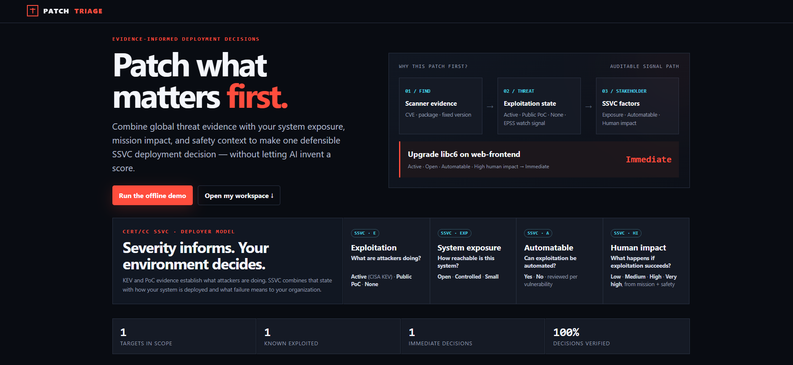

# PatchTriage

[](https://github.com/d01ki/PatchTriage/actions/workflows/deploy.yml)
[](https://github.com/d01ki/PatchTriage/actions/workflows/ci.yml)
[](LICENSE)
[](pyproject.toml)
[](https://certcc.github.io/SSVC/howto/deployer_tree/)

PatchTriage turns scanner evidence into environment-specific patch deployment
decisions. It ingests vulnerability scans or SBOMs, deduplicates findings,
adds exploitation and vendor evidence, and applies the deterministic
[CERT/CC SSVC Deployer model](https://certcc.github.io/SSVC/howto/deployer_tree/).

The output is a defensible action queue with one of four plain-language SSVC
outcomes: **Immediate**, **Out-of-Cycle**, **Scheduled**, or **Defer**.

**Live tool:** [https://patch-triage.com/](https://patch-triage.com/)

> AI never chooses the SSVC outcome and never invents a score. Optional AI
> backends can improve explanations and remediation guidance only. Their
> outcome, action, deadline, numeric claims, and remediation text are checked
> against the deterministic result and flagged when they conflict.

## Why PatchTriage uses SSVC

PatchTriage is an **SSVC-first patch deployment decision tool**. It implements
the published CERT/CC Deployer decision model (`ssvc:DT_DP:1.0.0`) rather than
inventing a proprietary risk score. For every finding, the engine records the
four decision points that determine deployment timing:

```text
Exploitation + System Exposure + Automatable + Human Impact
                              |
                              v
           Defer / Scheduled / Out-of-Cycle / Immediate
```

Mission Impact and Safety Impact are combined through the published Human
Impact table. CISA KEV can establish `Exploitation = Active`, but it does not
bypass the SSVC tree; EPSS and CVSS remain visible supporting evidence instead
of silently becoming a new score. Unknown inputs use the official conservative
defaults and are flagged for confirmation.

The implementation is checked offline against all **72 Deployer paths** and
all **16 Human Impact combinations** with `patchtriage verify`. See the
[reviewer validation protocol](docs/VALIDATION.md).

## DEMO

click 
[](https://youtu.be/UxSTwKSwf0U)

Or watch directly:
https://youtu.be/UxSTwKSwf0U


## Quick start with Docker

Docker is the shortest path to the GUI:

```bash
git clone https://github.com/d01ki/PatchTriage
cd PatchTriage
./run.sh
```

Open [http://localhost:8765](http://localhost:8765). The equivalent command is:

```bash
docker compose up gui
```

Stop the console with `./run.sh --stop` or `docker compose down`. Targets,
attached evidence, reports, and caches persist in Docker volumes.

To run the bundled air-gapped demonstration instead:

```bash
docker compose run --rm demo
# HTML: ./out/demo_report.html
# JSON: ./out/demo_report.json
```

## Local installation

Python 3.10 or newer is required.

```bash
python -m venv .venv
# Linux/macOS
source .venv/bin/activate
# Windows PowerShell
# .\.venv\Scripts\Activate.ps1

python -m pip install -e .
patchtriage serve
```

The GUI opens at [http://127.0.0.1:8765](http://127.0.0.1:8765). If the
console script is not on `PATH`, use:

```bash
python -m patchtriage.cli serve
```

Useful entry points:

```bash
patchtriage serve       # GUI
patchtriage demo        # reproducible offline demo
patchtriage start       # guided CLI workflow
patchtriage run --help  # scriptable pipeline
patchtriage fleet URL   # import a GitHub org and build one fleet queue
patchtriage verify      # offline conformance and repeatability proof
```


The **Upload evidence** button accepts:

- Trivy JSON;
- Grype JSON;
- osv-scanner JSON;
- CycloneDX JSON SBOM;
- SPDX JSON SBOM.

Scanner JSON already contains vulnerabilities. An SBOM contains components,
not vulnerability findings, so PatchTriage resolves its packages through
[OSV.dev](https://osv.dev) before assessment. That SBOM path therefore needs
network access; the bundled demo does not.

The **Import repository** button has two acquisition paths behind the same GUI
and API contract:

- Public `github.com` URLs use GitHub's Dependency Graph SBOM API. Repository
  code is not cloned or executed. The hosted anonymous importer deliberately
  uses no service token, so it cannot cross into private repositories.
- A local deployment may use `GITHUB_TOKEN` or `GH_TOKEN` to import a private
  GitHub repository that the operator's token can access. The token is read
  from the local environment and is never accepted in the URL or browser form.
- The local Docker GUI can also accept public generic HTTPS Git URLs. It clones
  into a disposable directory with hooks, submodules, LFS, credentials, and
  interactive prompts disabled, then uses the pinned OSV-Scanner v2 binary in
  static source-scan mode. A trusted empty scanner configuration prevents the
  repository from supplying ignore rules. Package managers and repository code
  are never run.
- The hosted/public deployment intentionally disables generic cloning and
  accepts public GitHub SBOM imports only.

Private GitHub repositories are local-token only. Private generic Git hosts,
SSH/scp URLs, embedded credentials, and `file://` or `git://` URLs are not
accepted. A GitHub `tree/<ref>` is retained as provenance, but GitHub's SBOM
endpoint is repository-wide, so the result is marked partial instead of
claiming a ref-specific scan.

See [Repository import and coverage model](docs/REPOSITORY_IMPORT.md) for the
support matrix, threat boundary, coverage states, and deployment controls.

## Fleet: assess an organization, not one repository

One deployed system is a *target*; an organization's repositories are a
*fleet*. The **Import organization…** button (GUI) and `patchtriage fleet`
(CLI) list a GitHub account's public repositories, turn each recently pushed
one into a target with its Dependency Graph SBOM attached — the exact same
no-clone, no-execution path and provenance rules as a single-repository
import — and merge the per-target SSVC results into one organization-wide,
outcome-ordered action queue.

```bash
patchtriage fleet https://github.com/your-org --limit 10 \
    --ssvc-exposure controlled --ssvc-mission-impact mef_support_crippled \
    --html fleet_report.html -o fleet.json
```

Boundaries, stated plainly:

- Aggregation never re-decides anything. Every finding's outcome was produced
  per target by the deterministic SSVC engine; the fleet view only merges and
  orders those results.
- Forks and archived repositories are skipped by default (`--include-forks`
  / `--include-archived` to opt in), and the listing reports exactly what was
  skipped or capped, so a fleet result is always explainable as "these
  repositories, chosen by this rule".
- Shared SSVC context supplied at import time is a starting point for
  triage, not a per-system assessment. Review each target's context in the
  GUI before treating its decision as final; unknown values use the official
  conservative defaults and stay flagged.
- One repository's failure (no dependency graph, too large) never aborts the
  rest; a provider rate limit or a target/quota ceiling stops the remainder
  visibly instead of half-succeeding in silence. Re-running an import is
  idempotent — already-imported repositories are recognized, not duplicated.
- Per-target coverage states carry into the fleet report, and unassessed
  targets are listed and excluded from every total, so an incomplete fleet
  can never look complete.

The hosted deployment caps repositories per import request
(`PATCHTRIAGE_MAX_FLEET_IMPORT_REPOS`, default 15) inside the existing
per-session target and evidence quotas, and its anonymous importer remains
public-repositories-only.

## What target context means

The GUI asks only for organizational inputs that belong to the official SSVC
Deployer method. Describe the deployed target and the credible consequence of
its failure, not the vulnerability itself.

| GUI field | What to assess | CERT/CC values | Default when unknown |
|---|---|---|---|
| System Exposure | How attackers can reach this deployed system | Small, Controlled, Open | Open |
| Mission Impact | Effect on Mission Essential Functions (MEFs) | Degraded, MEF Support Crippled, MEF Failure, Mission Failure | MEF Support Crippled |
| Safety Impact | Highest credible harm to people, systems, environment, finances, or well-being | Negligible, Marginal, Critical, Catastrophic | Marginal |

The SSVC engine evaluates the remaining decision points as follows:

- **Exploitation** is derived from authoritative threat evidence. A CISA KEV
  listing is Active; public exploit evidence can establish Public PoC. The GUI
  lets an analyst confirm the value for each finding. An analyst input cannot
  downgrade authoritative CISA KEV Active evidence; a conflicting input is
  kept visible and flagged for confirmation.
- **Automatable** is vulnerability-specific. PatchTriage derives it per
  finding from CVSS v4 `AU`. If it is unavailable, the official conservative
  default is Yes and the GUI asks an analyst to confirm or replace the value.
  It is intentionally not a target-wide field.
- **Human Impact** is derived by the published CERT/CC table from the target's
  Mission Impact and Safety Impact.

`Unknown` is a PatchTriage capture state, not an additional SSVC value. The
official conservative default is applied and the inferred field remains
visibly marked for confirmation.

Official definitions:

- [SSVC Deployer decision tree](https://certcc.github.io/SSVC/howto/deployer_tree/)
- [System Exposure](https://certcc.github.io/SSVC/reference/decision_points/system_exposure/)
- [Automatable](https://certcc.github.io/SSVC/reference/decision_points/automatable/)
- [Mission Impact](https://certcc.github.io/SSVC/reference/decision_points/mission_impact/)
- [Safety Impact](https://certcc.github.io/SSVC/reference/decision_points/safety_impact/)
- [Human Impact](https://certcc.github.io/SSVC/reference/decision_points/human_impact/)

## Reading the result

SSVC produces a categorical deployment decision, not a numerical risk score.

| Outcome | Plain-language action | PatchTriage operational target |
|---|---|---:|
| Immediate | Act now | 3 days |
| Out-of-Cycle | Use the next available deployment opportunity | 14 days |
| Scheduled | Include in normal maintenance | 30 days |
| Defer | Monitor and reassess | 90 days |

The day targets are PatchTriage workflow defaults; they are not additional
CERT/CC decision values. Organizations should map them to their own policy.

### Where GUI data is stored

The scan/SBOM upload and generated HTML report are processed on the machine
running PatchTriage and stored under its configuration directory. With Docker
Compose this is the `config` volume mounted at
`/home/patchtriage/.config/patchtriage`.

The web GUI assigns each browser a random HttpOnly session cookie. Targets,
uploads, run summaries, and reports are stored in a separate server directory for that
anonymous session, so one visitor cannot list or open another visitor's data.
Anonymous session data expires after six hours. Refreshing the page restores
the latest summary. Changing evidence, target context, or vulnerability-level
SSVC inputs invalidates the old summary and report before another run.

This is anonymous isolation, not user authentication. A person who obtains a
session cookie can access that session, so the public demo should not receive
confidential production scans. Use the local Docker deployment or add an
authentication proxy when assessing sensitive assets.

### Why Scheduled has no SSVC score

That is intentional. A Scheduled result is a complete SSVC outcome, not a
missing calculation. The GUI and HTML report still show:

- the four decision-point values and their evidence sources;
- confidence and any values that need confirmation;
- CVSS;
- EPSS 30-day probability;
- CISA KEV status;
- fixed-version availability;
- vendor advisories and the machine-audit result.

CVSS, EPSS, KEV, and fix availability remain visible as supporting evidence.
Inside the same outcome, the SSVC decision points are compared first, followed
by EPSS and CVSS tie-breakers. No values are added together into a score, and
no tie-breaker can override the categorical outcome.

### Zero findings and incomplete coverage

PatchTriage separates these states:

- **No findings reported** means a supplied scanner result contained no
  vulnerability records, or every queryable SBOM component was checked and no
  matching OSV record was returned.
- **Coverage incomplete or bounded** means at least one component lacked a
  usable package identity/version, an OSV batch/detail request failed, a
  provider returned no packages, no supported repository manifest was
  detected, or the original scanner/provider scope could not be independently
  verified.

Neither state is an SSVC Defer decision or proof that the target is secure.
Every non-`complete` status is highlighted in both the GUI and downloadable
HTML report. The result records total, queryable, queried, skipped, and failed
components so the operator can decide whether the evidence is sufficient.

## Bundled demo

The demo uses frozen Trivy, Grype, EPSS, CISA KEV, and NVD evidence, so it
works without a network or API key. Its three deduplicated findings illustrate
why severity alone is not the deployment decision:

| SSVC outcome | Vulnerability | Package | CVSS | EPSS | CISA KEV |
|---|---|---|---:|---:|---|
| Immediate | CVE-2023-4911 | libc6 | 7.8 | 0.856 | Yes |
| Scheduled | CVE-2024-3094 | xz-utils | 10.0 | 0.372 | No |
| Scheduled | CVE-2021-23337 | lodash | 7.2 | 0.018 | No |

The known-exploited finding is surfaced before the CVSS 10.0 finding, while
the exact outcome remains explainable from the SSVC path and target context.
This small demo proves pipeline behavior, not real-world effectiveness.

## Scriptable usage

```bash
# Scanner output to JSON and self-contained HTML reports
patchtriage run trivy.json grype.json \
  --assets assets.yaml \
  --html report.html \
  -o report.json

# SBOM to assessed findings through OSV.dev
patchtriage run sbom.spdx.json --html report.html

# Enter explicit target context without an inventory
patchtriage run trivy.json \
  --ssvc-exposure open \
  --ssvc-mission-impact mef_failure \
  --ssvc-safety-impact critical

# Skip slower NVD enrichment; retain EPSS and CISA KEV
patchtriage run trivy.json --no-nvd

# Query every vendor connector, or disable vendor advisories
patchtriage run trivy.json --vendor-sources all
patchtriage run trivy.json --no-vendor-advisories
```

An advanced `--ssvc-automatable yes|no` override exists for cases where an
analyst has established the value for the vulnerabilities in that run. Do not
use it as a generic property of the target.

Example `assets.yaml`:

```yaml
assets:
  - match: "web-frontend*"
    system_exposure: open
    mission_impact: mef_failure
    safety_impact: critical
```

Generate inputs with scanners you already use:

```bash
trivy image --format json -o trivy.json myorg/web-frontend:1.4
grype myorg/web-frontend:1.4 -o json > grype.json
osv-scanner scan source --format json --recursive ./repo > osv.json
```

## Evidence connectors

Core enrichment uses EPSS, CISA KEV, and optionally NVD. Vendor connectors are
selected from package and distribution metadata by default.

| Source | Evidence returned |
|---|---|
| Microsoft MSRC | Update document and CVRF/CSAF reference |
| Red Hat RHSA | Advisory, severity, and released packages |
| Ubuntu USN | Advisory, affected packages, and fixed versions |
| Debian Security Tracker | Distribution release status and fixed versions |
| GitHub GHSA | Advisory, ecosystem packages, patched version, and vulnerable functions |

The connectors work without credentials. `GITHUB_TOKEN`/`GH_TOKEN` and
`NVD_API_KEY` only raise public API rate limits. Connector failures are
recorded per finding and do not abort the assessment.

## Optional AI explanations

Install the additional dependency and provide an Anthropic API key:

```bash
python -m pip install -e ".[ai]"
export ANTHROPIC_API_KEY=...

patchtriage run trivy.json --triage claude --html report.html
patchtriage run trivy.json --triage cascade --html report.html
```

- `rules`: deterministic SSVC only; default and suitable for CI.
- `claude`: deterministic SSVC plus an AI-written explanation.
- `cascade`: screens every result and escalates only urgent, uncertain, or
  audit-failing explanations to the larger configured model.

If an API call fails, the finding falls back to deterministic output. The
audit rejects outcome, action, deadline, or signal claims that conflict with
the evidence.

## Pipeline

```text
scan JSON / SBOM
        |
        v
ingest -> deduplicate -> apply target context -> enrich threat/vendor evidence
        -> SSVC Deployer decision -> machine audit -> remediation plan
        -> JSON + self-contained HTML report
```

Aliases such as CVE and GHSA are merged conservatively. Correlation keeps the
package ecosystem, purl namespace, installed version, and asset identity, so
same-name packages or different installed versions are not silently combined.
Remediation version ordering handles common SemVer, PEP 440, Maven qualifier,
and Debian-style forms and retains conflicting candidates instead of
discarding them. Evidence
provenance is retained in the JSON result. The HTML report has no CDN
dependency and can be opened offline or attached to a review ticket.

## Reproducibility and reviewer verification

Run the current engine's offline proof from a clean checkout:

```bash
python -m pip install -e .
patchtriage verify --repeats 100 --output verification_report.json
```

The verification command checks:

- all 72 published SSVC Deployer decision-table paths;
- all 16 published Human Impact combinations;
- target-registry context reaching the production decision engine unchanged;
- conservative handling of unknown context;
- repeated deterministic decision hashes;
- the frozen end-to-end ingest-to-audit pipeline;
- detection of altered outcomes, actions, deadlines, and decision paths.

The output includes SHA-256 fingerprints for the expectation data, frozen
inputs, engine source, and decisions. Run it twice and compare
`input_fingerprint` and `decision_fingerprint`; timestamps and environment
metadata may differ.

See [docs/VALIDATION.md](docs/VALIDATION.md) for the reviewer protocol. Files
under `benchmarks/` are retained as historical engineering artifacts and are
not evidence of the current SSVC engine's real-world effectiveness.

## Deployment notes

The GUI binds to localhost by default. For a trusted container or platform
service, bind explicitly and supply its assigned port:

```bash
patchtriage serve --host 0.0.0.0 --port 8765 --no-browser
```

Do not use `patchtriage demo` as a web-service start command: it writes a
report and exits, so no port remains open. The production demo at
[patch-triage.com](https://patch-triage.com/) runs the same container entry
point on AWS Lightsail. Place any non-demo internet-facing instance behind the
access controls appropriate for vulnerability and asset data.

Use explicit deployment settings behind TLS termination:

```bash
PATCHTRIAGE_DEPLOYMENT_MODE=public
PATCHTRIAGE_ALLOW_GENERIC_REPOSITORIES=false
PATCHTRIAGE_COOKIE_SECURE=true
PATCHTRIAGE_BUILD_SHA=<deployed-git-sha>
```

`/api/config` exposes the application version, build SHA, UI schema version,
repository capabilities, retention, and anonymous-workspace limits. Local and
hosted deployments serve the same HTML and API; unavailable capabilities are
reported and disabled rather than implemented as a separate interface.

## Limits

- PatchTriage does not apply patches.
- It is not a replacement for a vulnerability scanner.
- No tool can correctly scan every repository URL or ecosystem. Unsupported,
  inaccessible, private, or insufficiently described inputs fail explicitly or
  produce `coverage_incomplete`; they are never presented as a clean result.
- An empty result is not proof that a target is secure.
- SSVC depends on accurate organizational context and current threat evidence.
- The built-in evaluation compares queue orderings on the supplied inventory;
  it is not independent ground truth for remediation effectiveness.
- Human review remains required for inferred inputs and important deployment
  decisions.

## Development

```bash
python -m pip install -e ".[dev]"
pytest -q
patchtriage verify --repeats 25 --output verification_report.json
```

## License

[Apache License 2.0](LICENSE)
