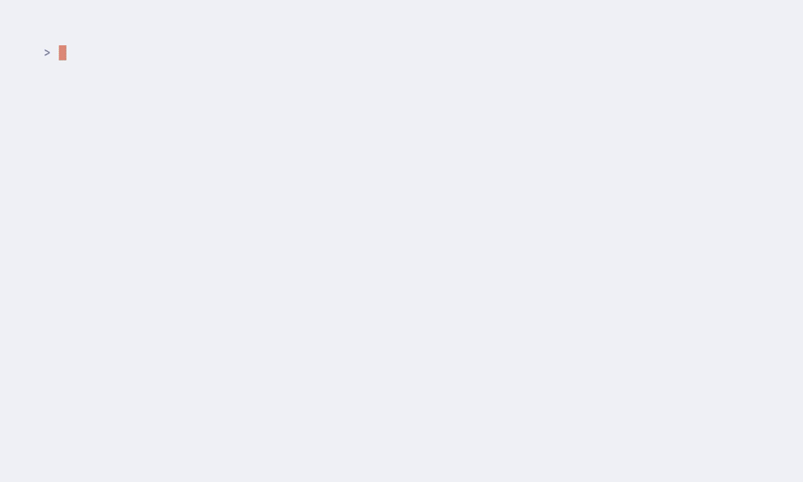

# PatchTriage

[](https://github.com/d01ki/patchtriage/actions/workflows/ci.yml)
[](LICENSE)
[](pyproject.toml)

**AI-assisted vulnerability triage for the frontier-AI era.**

Frontier AI models and automated scanners now surface vulnerabilities faster
than any team can patch them. The bottleneck has moved from *finding*
vulnerabilities to *deciding what to fix first*. PatchTriage ingests raw
scanner output, deduplicates findings across tools, enriches them with
authoritative exploitation signals (EPSS, CISA KEV, NVD), and then applies an
analyst-grade reasoning layer — either deterministic rules or a frontier LLM —
to produce a defensible, prioritized patch plan.

**Design principle: the LLM never invents numbers.** All scores and
exploitation data come deterministically from authoritative sources. The AI
layer only *reasons over* those signals, the way a human analyst would, and
returns structured, auditable decisions.



*(Regenerate this GIF with `vhs docs/demo.tape` — see [charmbracelet/vhs](https://github.com/charmbracelet/vhs).)*

## Fastest path: just Docker (nothing else to install)

No Python, no venv, no PEP 668 headaches — if you have Docker, you have
everything:

```bash
git clone https://github.com/d01ki/patchtriage && cd patchtriage
./run.sh                         # builds, starts the console, opens your browser
# equivalently: docker compose up gui   ->   http://localhost:8765
```

`./run.sh` builds the image, starts the console, waits until it is ready, and
opens `http://localhost:8765`. Stop it with `./run.sh --stop`. (Upgraded from
an older version and hitting permission errors? Reset the volumes once with
`docker compose down -v`.)

That launches the **web console**: register your systems as targets, import a
scan or SBOM per target from the browser, and run triage — no local scanner
or API key required (SBOMs are resolved online via OSV.dev). `Ctrl-C` stops
it; `docker compose up -d gui` runs it in the background. Registered targets
and reports persist across restarts.

Just want the offline demo?

```bash
docker compose run --rm demo     # report appears in ./out/demo_report.html
```

### Or install locally (Python 3.10+)

```bash
pip install -e .            # in a venv; on Debian/Ubuntu: python3 -m venv .venv first
patchtriage demo           # offline demo -> demo_report.html
patchtriage serve          # the same web console, natively
```

The demo ships with real Trivy/Grype output samples and offline snapshots of
EPSS / CISA KEV / NVD data, so the entire pipeline — ingest, dedup, context,
enrichment, triage, planning, HTML dashboard, and the built-in evaluation —
runs air-gapped.

## The usage flow

```
 1. scan (tools you already run)        2. describe your environment once
    trivy image --format json ...          assets.yaml  (glob -> criticality,
    grype <image> -o json ...                            internet exposure)
    osv-scanner --format json ...
                    \                          /
                     v                        v
 3. patchtriage run *.json --assets assets.yaml --html report.html -o report.json
                     |
                     v
 4. work the plan top-down: each row = one concrete change (e.g. "Upgrade
    libc6 to 2.36-9+deb12u3 on web-frontend"), ranked by risk actually removed
 5. (optional) --triage claude for analyst-grade rationales per finding
 6. re-scan after patching; re-run; the report shows what burned down
```

## Proving practicality: the built-in evaluation

Every run ends with an honesty check. For the same findings and a fixed work
budget k ("you only have time to fix k things this week"), three orderings are
compared: the industry default (CVSS descending), the strongest simple
alternative (EPSS descending), and PatchTriage's. Metrics
come from third-party ground truth — CISA KEV membership and FIRST EPSS
probability — so the tool cannot grade its own homework. From the demo:

| Budget | KEV — CVSS | KEV — EPSS | KEV — PatchTriage | EPSS mass — CVSS | EPSS mass — EPSS | EPSS mass — PatchTriage |
|--------|------------|------------|-------------------|------------------|------------------|-------------------------|
| top 1  | 0/1        | **1/1**    | **1/1**           | 0.372            | **0.856**        | **0.856**               |

With a budget of one fix, CVSS-sorting spends it on the flashy 10.0 while the
vulnerability being exploited in ransomware campaigns waits. PatchTriage
spends it on the one that is actually being used against you. Run the same
evaluation on your own scans — it is printed on every `run`.

## Why CVSS alone is not enough

Run the bundled demo and you'll see it immediately:

| Pri | CVE | Package | CVSS | EPSS | KEV | Decision |
|-----|-----|---------|------|------|-----|----------|
| **P1** | CVE-2023-4911 | libc6 | 7.8 | 0.856 | **YES (ransomware)** | patch_now |
| P2 | CVE-2024-3094 | xz-utils | **10.0** | 0.372 | – | patch_scheduled |
| P3 | CVE-2021-23337 | lodash | 7.2 | 0.018 | – | patch_scheduled |

Sorting by CVSS would put the 10.0 first. PatchTriage puts the
actively-exploited 7.8 first — because that is what is actually being used
against you in the wild.

## Architecture

```
 scanner outputs          PatchTriage pipeline
┌───────────────┐   ┌──────────────────────────────────────────┐
│ Trivy JSON    │   │ [1] Ingest    → normalize to one schema  │
│ Grype JSON    ├──▶│ [2] Dedup     → merge across scanners    │
│ osv-scanner   │   │               (CVE/GHSA alias graph)     │
│ (pluggable)   │   │ [3] Enrich    → EPSS · CISA KEV · NVD    │
└───────────────┘   │               (deterministic, cached)    │
                    │ [4] Context   → asset criticality/expo.  │
                    │ [5] AI triage → rules | claude backend   │
                    │ [6] Report    → table / JSON / tickets   │
                    └──────────────────────────────────────────┘
```

* **Layer 1 — Ingest** (`ingest/parsers.py`): parsers for Trivy, Grype and
  osv-scanner with automatic format sniffing. Every record is mapped to a
  common `RawFinding` schema. Adding a scanner is one function.
* **Layer 2 — Dedup** (`dedup.py`): builds a cross-scanner alias graph so a
  Trivy `CVE-2021-23337` and a Grype `GHSA-35jh-…` merge into one finding.
  Merge policy is conservative: max severity/CVSS wins, sources are unioned,
  nothing is silently dropped.
* **Layer 3 — Enrich** (`enrich/clients.py`): batch EPSS lookups, the full
  CISA KEV catalog (incl. ransomware-campaign flags and due dates), and NVD
  CVSS/CWE/exploit-reference data. Everything is cached in
  `~/.cache/patchtriage` — re-runs are free and the tool works offline after
  the first sync. No API keys required (an NVD key raises rate limits).
* **Layer 4 — Context** (`context.py`): a small `assets.yaml` inventory
  (glob rules) teaches the tool which assets are business-critical,
  internet-exposed, statically reachable, or observed at runtime by eBPF,
  Falco, or OpenTelemetry. Positive reachability/runtime evidence increases
  confidence; missing telemetry never suppresses risk. The same CVE on an
  active checkout path and an unknown internal batch box should not rank the
  same.
* **Layer 5 — Triage** (`triage/engine.py`): pluggable backends behind one
  interface.
  * `rules` — deterministic baseline (KEV or high-EPSS-and-exposed ⇒ P1, …).
    Runs anywhere, no keys, ideal for CI.
  * `claude` — sends each enriched finding to the Anthropic API
    (default `claude-opus-4-8`), with structured output enforced through
    strict tool use. The model receives the deterministic signals and returns
    `{priority, action, rationale, suggested_deadline_days}`. Calls run in
    parallel (`--jobs`), and any finding whose API call fails degrades
    gracefully to the rules baseline (tagged `rules_fallback` in the report)
    — a network blip never aborts a 2,000-finding run.
  * `cascade` — a two-tier agent pipeline. A fast screening model
    (default `claude-haiku-4-5`) triages every finding; a finding is
    escalated to the frontier model (default `claude-opus-4-8`) only when it
    is **high-signal** (CISA KEV, EPSS ≥ 0.1, or on an internet-exposed
    critical asset) or when its screening decision **fails the machine
    audit**. Frontier reasoning exactly where mistakes are expensive,
    screening-tier cost everywhere else — and every routing decision is
    recorded (`escalated`, `escalation_reasons`) so the cascade itself is
    auditable.

## Install

```bash
pip install -e .          # core pipeline
pip install -e ".[ai]"    # + Anthropic backend
pip install -e ".[dev]"   # + pytest
```

## Web console (GUI)

Prefer clicking to typing? Launch the local web console:

```bash
patchtriage serve            # opens http://127.0.0.1:8765 in your browser
```

Register each internal system as a **target** (name, a **link URL** to its
dashboard/repo/runbook, business criticality, internet exposure), attach a
scan or an SBOM per target, and hit **Run all**. You get a per-target result
board — priority counts, KEV count, top remediation action, audit status —
where every target name is a **clickable link out to the system**, and each
result opens its full HTML report. Built for estates with many systems; the
registry persists under `~/.config/patchtriage`. Standard-library only (no
web framework), binds to localhost, and the same asset-context logic applies:
the identical SBOM ranks P1 on an exposed critical service and P2 on an
internal low-criticality one.

```bash
docker compose up gui        # same console in a container -> http://localhost:8765
```

## Interactive setup & guided run

No flags to memorize — two commands walk you through everything:

```bash
patchtriage setup    # asks for your API keys one by one, validates the
                     # Anthropic key live (no tokens spent), lets you pick a
                     # default backend, saves to ~/.config/patchtriage/
patchtriage start    # asks what to triage (scan JSON or SBOM), asset
                     # context, backend, output paths - then runs the report
```

Keys entered in `setup` are stored locally (0600) and exported for every
later command; environment variables always take precedence, so CI and
containers are unaffected.

## Have an SBOM, no scanner? (e.g. GitHub's SPDX export)

An SBOM lists *components*, not vulnerabilities — so on its own there is
nothing to triage. PatchTriage bridges that gap online: point it at a
CycloneDX or SPDX file and it resolves every package against the free
[OSV.dev](https://osv.dev) database to get the vulnerabilities, then enriches
and triages them exactly like scanner output. **No Trivy/Grype install
needed — just network access.** This is the path when you cloned the repo on
a plain Linux box and your SBOM came from GitHub's dependency graph:

```bash
# GitHub -> repo -> Insights -> Dependency graph -> Export SBOM (SPDX JSON)
patchtriage run sbom.spdx.json --criticality high --html report.html
# CycloneDX works too (syft, cdxgen, cyclonedx-* all emit it):
patchtriage run bom.cdx.json -o report.json
```

The format is auto-detected. OSV responses are cached, so re-runs are cheap.

## Usage

```bash
# Deterministic triage of one or more scanner outputs
patchtriage run trivy.json grype.json --exposed --criticality high -o report.json

# Skip NVD for speed (EPSS + KEV only)
patchtriage run trivy.json --no-nvd

# Frontier-AI triage (key from `patchtriage setup` or ANTHROPIC_API_KEY)
patchtriage run trivy.json grype.json --triage claude --limit 50

# Cascade: screen everything with Haiku, escalate only what matters to Opus
patchtriage run trivy.json grype.json --triage cascade

# Include positive reachability/runtime evidence without an inventory file
patchtriage run trivy.json --reachable --runtime-observed --exposed

# Bulk overnight re-triage at 50% API cost via the Message Batches API
patchtriage run trivy.json --triage claude --batch

# Tune parallelism / models
patchtriage run trivy.json --triage cascade --jobs 8 \
    --model claude-haiku-4-5 --escalation-model claude-opus-4-8
```

### Everything runs containerized (nothing but Docker on the host)

```bash
docker compose run --rm demo         # offline demo -> ./out/demo_report.html
docker compose run --rm start        # interactive guided run (asks questions)
docker compose run --rm triage run /work/sbom.spdx.json \
    --criticality high -o /out/report.json --html /out/report.html
```

Files under the repo dir appear at `/work` inside the container; reports
written to `/out` land in `./out` on the host. `start` keeps stdin attached
so the wizard works, auto-skips the browser step in a container, and prints
the report path under `./out` instead. `ANTHROPIC_API_KEY` / `NVD_API_KEY`
are read from your shell environment (optional — `rules` needs neither).

Generate inputs with the scanners you already run:

```bash
trivy image --format json -o trivy.json  myorg/web-frontend:1.4
grype myorg/web-frontend:1.4 -o json > grype.json
osv-scanner --format json -r ./repo > osv.json
```

## Output

`report.json` contains every finding with full provenance:

```json
{
  "vuln_id": "CVE-2023-4911",
  "package": {"name": "libc6", "version": "2.36-9",
              "fixed_version": "2.36-9+deb12u3"},
  "reported_by": ["grype", "trivy"],
  "enrichment": {"epss_score": 0.856, "in_cisa_kev": true,
                 "kev_ransomware": true, "nvd_cvss_score": 7.8},
  "triage": {"priority": "P1", "action": "patch_now",
             "suggested_deadline_days": 3,
             "rationale": "Actively exploited (KEV, ransomware) with a fix
                           available on an internet-exposed asset."}
}
```

Ground truth (`enrichment`) and AI output (`triage`) are separated by design,
so every decision is auditable against the signals it was made from.

## Auditability, planning and reporting

* **Audit** (`triage/audit.py`): every AI decision is machine-verified
  against the deterministic signals it was given. Four checks run on every
  finding: no fabricated numbers in the rationale (cited decimals must match
  real EPSS/CVSS values), known-exploited findings cannot be silently
  downgraded, patch actions require an available fix, and any 2+ level
  divergence from the deterministic baseline is flagged for human review.
  Divergence is allowed — the model may out-reason the rules — but silent
  divergence is not. Verified decisions get a ✓ in the report; flagged ones
  get a ⚑ with the reason.
* **Layer 6 — Plan** (`plan.py`): findings are the wrong unit of work —
  nobody patches one CVE at a time. Findings are grouped into concrete
  actions ("Upgrade libc6 to X on host Y") and ranked by **risk reduced per
  action** using an explainable model: likelihood (KEV=1.0, else EPSS) x
  impact (CVSS/10) x asset weight (criticality, exposure).
* **Layer 7 — Report** (`report/html.py`): one self-contained HTML file —
  priority spine, remediation ledger with risk-reduction bars, evaluation
  table, full findings with rationales. No CDN, opens offline, safe to attach
  to a ticket or email.
* **Evaluation** (`evalcmp.py`): the CVSS-vs-PatchTriage comparison described
  above, computed on every run.

## What PatchTriage does NOT do

* It does not apply patches. It decides *what to patch first* and hands the
  plan to your existing mechanisms (apt/WSUS/Ansible/CI).
* It is not a full vulnerability scanner. As a convenience path it can resolve
  CycloneDX/SPDX components through OSV.dev, while production scanner output
  from Trivy/Grype/osv-scanner remains the preferred input. PatchTriage is the
  decision layer on top.
* It does not let the LLM produce scores. Ever.

## Benchmark: PatchTriage catches 97% of what's being exploited; CVSS-sorting catches 1%

> **PatchTriage put 84 of 87 actively-exploited vulnerabilities into the same
> weekly patch queue that the industry-standard "sort by CVSS" approach filled
> with only 1.** Higher is better; the `1 / 87` column is the *baseline we beat*,
> not our result.

The setup: a security team can't patch everything at once. Say you can fix
**50 findings this week** (a "budget" — one package upgrade usually closes
many findings, so 50 is a light week). Which 50 do you pick? We compare two
ways of choosing — sort by CVSS (what most teams do today) vs PatchTriage —
and count how many of the *known-exploited* vulnerabilities (CISA KEV) each
one's 50 picks actually include.

We ran this against **11 pinned images of software enterprises actually
self-host internally** — Jenkins, Nextcloud, Redmine, Nexus, Gitea, Grafana,
SonarQube, Mattermost, Ghost, Metabase, WordPress — not base images or
frameworks.

| System | Findings | KEV caught — sort-by-CVSS | KEV caught — **PatchTriage** |
|---|---|---|---|
| Jenkins 2.319 | 1,267 | 0/10 | **10/10** |
| Nextcloud 20 | 9,700 | 0/28 | **26/28** |
| Redmine 4.1 | 9,432 | 0/22 | **21/22** |
| Nexus 3.30 | 1,936 | 0/9 | **9/9** |
| WordPress 5.5 | 2,137 | 0/16 | **16/16** |
| Metabase 0.40 | 349 | 1/2 | **2/2** |
| + Gitea, Grafana, SonarQube, Mattermost, Ghost | — | 0/0 | 0/0 |
| **Total (11 systems, ~26k findings)** | | **1 / 87 (1%)** | **84 / 87 (97%)** |

So of the 87 vulnerabilities CISA confirms are being exploited in the wild,
**PatchTriage's queue contained 84; the CVSS-sorted queue contained 1.**
PatchTriage also captured 2.6x more exploitation-probability mass (EPSS).
Full table: [docs/BENCHMARKS-systems-2026-07-11.md](docs/BENCHMARKS-systems-2026-07-11.md).

**Why CVSS does so badly — and why doubling the budget doesn't save it:**
these images carry hundreds of CVSS 9.x "critical" findings, while most
known-exploited CVEs score lower (often 7–8). A CVSS-sorted budget fills up
with 9.x criticals; the actually-exploited 7.x ones sit far below the cut. So
even *doubling* the budget barely helps CVSS — it caught **1/87 at 25/system
and still only 1/87 at 50/system** — while PatchTriage went 63→84. Ground
truth is third-party (CISA KEV, FIRST EPSS), so the tool cannot grade its own
homework.

This benchmark runs the **deterministic** backend (`--triage rules`), so the
97% comes purely from signal-based prioritization — no LLM, fully
reproducible, nothing to hallucinate. The `claude` / `cascade` AI backends
sit on top of the *same* signals and add analyst-grade rationales per finding
(every one machine-audited); they change the explanations, not the numbers.

The effect reproduces on other target sets — 18 end-of-life OS/runtime images
(`targets_eol.txt`) give **1/118 vs 99/118**
([docs/BENCHMARKS-2026-07-11.md](docs/BENCHMARKS-2026-07-11.md)). Run any set
yourself:

```bash
./benchmarks/run_benchmark.sh                                  # 5 current images
TARGETS_FILE=benchmarks/targets_systems.txt SCANNERS=trivy PRUNE=1 \
  ./benchmarks/run_benchmark.sh                                # self-hosted systems
TARGETS_FILE=benchmarks/targets_eol.txt SCANNERS=trivy \
  ./benchmarks/run_benchmark.sh                                # 18 EOL images
# -> benchmarks/out/BENCHMARKS.md with the aggregated comparison table
```

Local `trivy`/`grype` binaries are used when present; otherwise the script
falls back to pinned `aquasec/trivy` / `anchore/grype` container images, so
Docker alone reproduces the numbers. `SCANNERS=trivy` roughly halves runtime;
`PRUNE=1` removes each image after scanning on large runs.

## Roadmap

* Reachability analysis (is the vulnerable function actually called?)
* Ecosystem-aware version comparison for multi-fix packages
* Ticketing integrations (GitHub Issues / Jira)

## Development

```bash
pip install -e ".[dev]"
python -m pytest tests/
```

CI (GitHub Actions) runs the test suite on Python 3.10–3.12, executes the
full offline demo end-to-end, and builds + runs the Docker image on every
push.

## License

Apache-2.0
