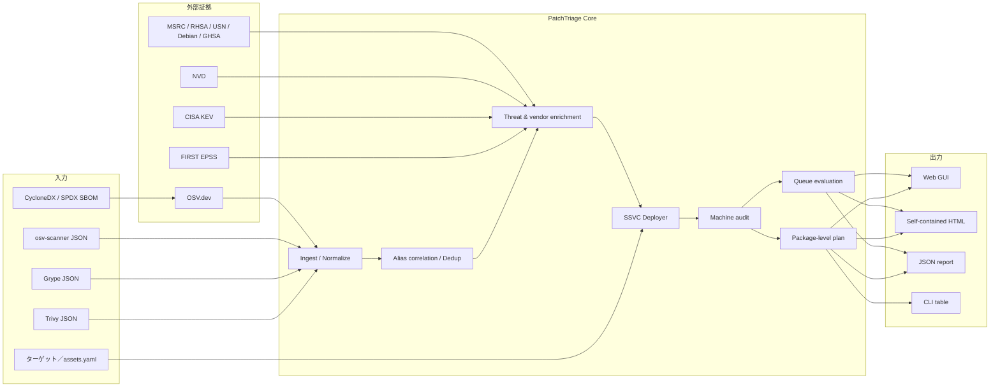
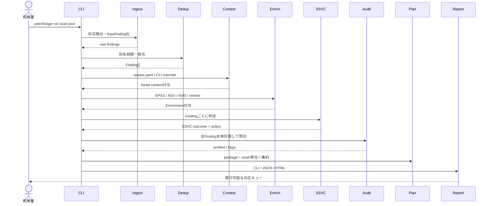
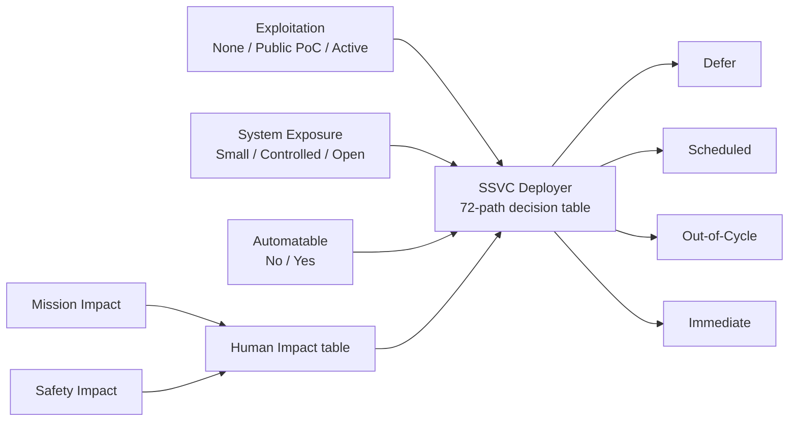
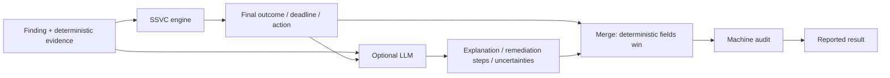

# PatchTriage 総合設計・技術仕様書

> 作成時点: 2026-07-15
> 対象実装: `main` / `c7e7b1e`
> 対象バージョン: `0.6.0`
> 文書の位置付け: 現行コードを正とした、個人確認用の設計・仕様・評価資料

## 目次

- 1〜4: 目的、プロダクト定義、設計原則、機能・非機能要求
- 5〜6: システム構成とエンドツーエンドフロー
- 7〜10: 入力、データモデル、重複排除、エンリッチメント
- 11: SSVC意思決定エンジンと全72経路
- 12〜14: AI支援、機械監査、Remediation Plan
- 15〜19: GUI、HTTP API、永続化、CLI、レポート
- 20〜22: キュー評価、再現性検証、テスト・CI
- 23〜25: セキュリティ、配備、技術スタック
- 26〜29: 実装状態、既知の制約、ロードマップ、不変条件
- 30〜32: ファイル案内、公式参照、最終整理

## 1. 文書の目的

この文書は、PatchTriageについて次の内容を一つにまとめた技術資料である。

- なぜこのツールが存在するのか
- 何を入力し、何を出力するのか
- どのような順序でデータを処理するのか
- SSVCをどのように実装・推論しているのか
- CVSS、EPSS、CISA KEV、ベンダーアドバイザリをどう扱うのか
- AIをどこで使い、どこでは使わないのか
- GUI、内部HTTP API、CLI、Dockerの構造
- 再現性・適合性・有効性をどう評価しているのか
- 現在できること、部分実装のこと、まだできないこと
- 今後どこを改善すべきか

READMEが利用開始のための入口であるのに対し、本書は実装者・評価者の視点で内部構造まで説明する。

---

## 2. エグゼクティブサマリー

PatchTriageは脆弱性スキャナーでも、パッチ適用ツールでもない。既存のスキャナーやSBOMが示す大量の脆弱性に対して、**この組織・この配備環境では、どの修正をいつ行うべきか**を決める意思決定支援ツールである。

中核となる設計は次のとおりである。

1. Trivy、Grype、osv-scanner、CycloneDX、SPDXを共通形式へ正規化する。
2. CVE・GHSAなどの別名を相関し、同じ問題を重複排除する。
3. EPSS、CISA KEV、NVD、公式ベンダー情報を付与する。
4. System Exposure、Mission Impact、Safety Impactという配備側の状況を加える。
5. CERT/CC SSVC Deployerの公式決定表を決定論的に適用する。
6. 結果をImmediate、Out-of-Cycle、Scheduled、Deferとして提示する。
7. 個別CVEではなく、パッケージ更新・緩和策という実行単位へまとめる。
8. AIを使う場合も、AIには結果の変更を許さず、説明と手順の補助だけを行わせる。
9. 全結果をもう一度決定論的エンジンで監査する。

最も重要な境界は、**脅威・重大度・環境を一つの独自数値へ合算しない**ことである。SSVCのカテゴリ結果を最上位に置き、EPSSやCVSSは同一カテゴリ内の決定論的なタイブレークと説明用証拠に限定する。

---

## 3. 解決する問題

### 3.1 背景

脆弱性管理では、スキャナーによる「発見」よりも、発見後の「対応順序の決定」がボトルネックになりやすい。CVSSだけでは技術的重大度は把握できても、次の情報を十分に表せない。

- 現在実際に悪用されているか
- 今後30日間に悪用される可能性がどの程度か
- インターネットから到達できる配備か
- 組織の重要業務にどの程度影響するか
- 人命、安全、環境、財務、ウェルビーイングへの影響は何か
- 修正版が実際に提供されているか
- 同じパッケージ更新で複数のCVEを同時に解消できるか

### 3.2 プロダクトゴール

入力された脆弱性証拠を、説明可能で監査可能な**配備アクションの順序**へ変換する。

### 3.3 非ゴール

現行PatchTriageは次を目的としない。

- 脆弱性を自ら発見すること
- パッチを自動適用すること
- CVSS、EPSS、KEV、SSVCを置き換える新しい標準を作ること
- AIに最終判断を委ねること
- 空のスキャン結果を「安全の証明」とみなすこと
- 現時点でSIEM、CMDB、チケットシステムへ直接書き込むこと

---

## 4. 設計原則

### 4.1 Standards first

判断の中心には[CERT/CC SSVC Deployerモデル](https://certcc.github.io/SSVC/howto/deployer_tree/)を使う。SSVC Deployerは配備者が、特定環境へ修正または緩和策をいつ適用するかを決めるモデルである。

### 4.2 Explainability first

結果だけでなく、次を保持・表示する。

- 各SSVC決定点の値
- 値の情報源
- 推論値か明示値か
- confidence
- 人による確認が必要か
- 決定パス
- CVSS、EPSS、KEV、修正版、公式アドバイザリ
- 機械監査の結果

### 4.3 Deterministic core

AIを無効にした場合、同じ入力・同じスナップショット・同じコードから同じ判定を得る。AIを有効にしてもSSVC判定、内部優先度、期限、最終アクションは決定論的エンジンが所有する。

### 4.4 Privacy first

通常のGUIとCLIはローカルで実行できる。ただし「完全に外部通信しない」という意味ではない。

- スキャンJSONの解析はローカルで行う。
- SBOM解決時はパッケージ識別子とバージョンをOSV.devへ送る。
- オンラインエンリッチメント時はCVE IDをEPSS、CISA、NVD、ベンダーAPIへ問い合わせる。
- AI有効時はFindingの構造化情報、Asset情報、最大600文字の説明をAnthropic APIへ送る。
- 完全オフラインが保証される経路は、同梱スナップショットを使う`demo`と`verify`である。

### 4.5 Graceful degradation

- AI APIの失敗はFinding単位で決定論的SSVCへフォールバックする。
- ベンダーコネクターの失敗はFindingに警告として記録し、全処理は継続する。
- 一方、通常のEPSS・KEV取得失敗は現状ではパイプラインを失敗させる。これは後述する改善点である。

### 4.6 機能要求

| ID | 要求 | 現行の受け入れ条件 |
|---|---|---|
| FR-01 | Scanner ingest | Trivy、Grype、osv-scanner JSONを自動判別しRawFindingへ変換できる |
| FR-02 | SBOM ingest | CycloneDX/SPDX JSONからcomponentを抽出し、OSV経由でFinding候補を生成できる |
| FR-03 | Correlation | CVE/GHSA alias、package、assetを使ってscanner間の重複を統合できる |
| FR-04 | Threat evidence | EPSS、CISA KEV、NVDをFindingへ付与できる |
| FR-05 | Vendor evidence | MSRC、RHSA、USN、Debian、GHSAを共通Advisoryへ正規化できる |
| FR-06 | Stakeholder context | System Exposure、Mission Impact、Safety Impactと出典をtargetへ記録できる |
| FR-07 | SSVC decision | 公式Deployer 72経路から4 outcomeのいずれかを決定できる |
| FR-08 | Explainability | 各決定点の値、source、confidence、evidence、confirmation、pathを表示できる |
| FR-09 | Remediation planning | Findingをasset・package単位のupgrade/mitigate作業へ集約できる |
| FR-10 | Reporting | CLI、JSON、自己完結HTMLで結果を出力できる |
| FR-11 | GUI operation | target追加、context編集、source添付、run、report閲覧、削除ができる |
| FR-12 | Optional AI | SSVCを変更せず説明・手順・不確実性を補助できる |
| FR-13 | Verification | 公式表適合、入力伝播、反復性、end-to-end、tamperをoffline検証できる |
| FR-14 | Demo | networkとAPI keyなしで同梱データの全pipelineを再現できる |

### 4.7 非機能要求

| ID | 品質特性 | 現行仕様 |
|---|---|---|
| NFR-01 | Determinism | rules backendは同じ固定入力から同じdecision projectionを返す |
| NFR-02 | Auditability | 元証拠とtriageを分離し、全結果を再計算監査する |
| NFR-03 | Traceability | decision pointごとにsource/confidence/evidenceを保持する |
| NFR-04 | Local-first | GUI、scanner parsing、rules判定、reportはローカル実行可能 |
| NFR-05 | Portability | Python 3.10〜3.12とDockerでCI確認する |
| NFR-06 | Minimal web dependency | GUI serverは標準ライブラリ、page/reportはCDNなし |
| NFR-07 | Failure isolation | AIとvendor failureをFinding/source単位で隔離する |
| NFR-08 | Input safety | schema validation、size limit、target ID/URL検証を行う |
| NFR-09 | Reproducibility | fixture、snapshot、source、decisionにSHA-256 fingerprintを持つ |
| NFR-10 | Backward compatibility | `rules`名と内部P1〜P4、CLI Asset fieldsを当面維持する |

性能SLO、最大同時利用者数、大規模Finding数に対する応答時間、可用性SLAは現時点で正式定義されていない。

---

## 5. システム全体像



### 5.1 レイヤー構成

| レイヤー | 主なモジュール | 責務 |
|---|---|---|
| Ingest | `ingest/parsers.py`, `ingest/sbom.py` | 入力形式の検出、共通RawFindingへの変換 |
| Dedup | `dedup.py` | CVE/GHSA別名相関、パッケージ・資産単位の重複排除 |
| Context | `context.py`, `targets.py` | 配備環境・組織影響・補助証拠の付与 |
| Enrichment | `enrich/clients.py`, `enrich/vendors.py` | EPSS、KEV、NVD、公式ベンダー情報 |
| Decision | `ssvc.py` | SSVC決定点の推論、公式決定表、順序付け |
| AI assistance | `triage/engine.py` | 決定論的・Claude・Cascadeバックエンド |
| Audit | `triage/audit.py` | SSVC整合性、数値、fix、証拠完全性の再検証 |
| Planning | `plan.py` | Findingをパッケージ更新／緩和アクションへ集約 |
| Evaluation | `evalcmp.py`, `presentation.py` | CVSS/EPSS/KEV-first/SSVCのキュー比較 |
| Reporting | `report/html.py` | 自己完結HTMLと説明表示 |
| GUI | `webapp/page.py`, `server.py`, `runner.py` | ローカルWebコンソール、HTTP API、ターゲット実行 |
| Verification | `validation.py`, `data/ssvc_validation.json` | 適合性、再現性、入力伝播、改ざん検知 |

---

## 6. エンドツーエンド処理フロー

### 6.1 CLIの処理順序



実コード上の順序は、`ingest → dedup → context → enrich → triage → audit → plan → evaluation → emit`である。

### 6.2 GUIの処理順序

GUIではターゲットから`Asset`を先に生成し、そのAssetを各RawFindingへ埋め込む。その後、`ingest → dedup → enrich → triage → audit → plan → evaluation → HTML生成`を実行する。

ブラウザーの「Run all」は対象を一件ずつ順番に実行する。HTTPサーバー自体は`ThreadingHTTPServer`であり、APIを直接並行実行することは可能だが、同一ターゲットの同時runを排他するジョブ管理機構は現状ない。

### 6.3 空結果

Findingが0件の場合はエンリッチメント・SSVC・評価を行わず、`result_state = no_findings`を返す。

これは次のどちらかを意味する。

- スキャンJSONに脆弱性レコードがなかった。
- SBOMのコンポーネントがOSVで既知脆弱性へ解決されなかった。

これはDefer判定ではなく、安全の証明でもない。

---

## 7. 入力仕様

### 7.1 対応形式

| 入力 | 検出条件・経路 | ネットワーク |
|---|---|---|
| Trivy JSON | `Results`と`ArtifactName`または`SchemaVersion` | 解析のみなら不要 |
| Grype JSON | `matches`と`descriptor` | 解析のみなら不要 |
| osv-scanner JSON | `results[].packages` | 解析のみなら不要 |
| CycloneDX JSON | `bomFormat=\"CycloneDX\"`など | OSV解決に必要 |
| SPDX JSON | `spdxVersion`または`SPDXID + packages` | OSV解決に必要 |

現状はJSONのみを対象とし、XML CycloneDXやtag/value SPDXは対象外である。

### 7.2 Scanner parser

#### Trivy

- ArtifactNameを既定のAsset identifierにする。
- VulnerabilityIDを主IDとする。
- CVSSのV3、V4、V2スコアから最大値を採用する。
- PkgName、InstalledVersion、FixedVersion、PURL、Severityを抽出する。

#### Grype

- `source.target`をAsset identifierにする。
- `relatedVulnerabilities`を別名として取り込む。
- vulnerabilityおよびrelated vulnerabilityのCVSSから最大値を採用する。
- 最初のfix versionを採用する。

#### osv-scanner

- source pathをAsset identifierにする。
- OSV aliasesの中にCVEがあればCVEを正規IDとする。
- affected ranges内のfixed eventを修正版として取り込む。
- OSVのベクターは現状スキャナーCVSS数値へ変換せず、NVDエンリッチメントに委ねる。

### 7.3 SBOM解決

1. CycloneDXのcomponentsを再帰走査、またはSPDXのpackagesを走査する。
2. Package URLがあればPURLを優先する。
3. PURLがない場合、ecosystem・name・versionが揃うものだけを問い合わせる。
4. OSV `querybatch`を最大100コンポーネント単位で呼ぶ。
5. 得られた脆弱性IDごとにOSV vulnerability detailを取得する。
6. OSV結果を`source_scanner = osv-sbom`のRawFindingへ変換する。

PURLもecosystem/versionも不足するコンポーネントは問い合わせ不能であり、脆弱性なしとしてではなく「未照会」と解釈すべきである。現行レポートは未照会コンポーネント数を個別表示しないため、これは重要な改善余地である。

### 7.4 assets.yaml

CLIではAsset identifierに対するglobの最初の一致を適用する。

```yaml
assets:
  - match: "web-frontend*"
    criticality: critical
    internet_exposed: true
    system_exposure: open
    mission_impact: mef_failure
    safety_impact: critical
    reachable: true
    runtime_observed: true
    context_sources: [CMDB, service-owner, BCP]
    owner: platform-team
    notes: customer checkout
```

`automatable`も後方互換・高度な明示指定としてモデルとCLI inventoryには残るが、本来は脆弱性固有の値である。GUIではターゲット共通値として入力させず、必ず脆弱性ごとに推論する。

---

## 8. 共通データモデル

データモデルはPydanticで定義される。

### 8.1 主要オブジェクト

| オブジェクト | 意味 | 主なフィールド |
|---|---|---|
| `Package` | 脆弱なコンポーネント | name, version, ecosystem, purl, fixed_version |
| `Asset` | コンポーネントが存在する配備対象 | identifier, kind, SSVC context, reachability, owner |
| `RawFinding` | 一つのスキャナーが報告した一件 | vuln_id, aliases, scanner, package, asset, CVSS, raw |
| `Finding` | 重複排除後の一件 | stable key, merged aliases, reported_by, enrichment, triage |
| `Enrichment` | 外部から得た決定論的証拠 | EPSS, KEV, NVD, CWE, exploit refs, vendor advisories |
| `VendorAdvisory` | ベンダー情報の共通形式 | source, advisory_id, products, fixed_versions, functions |
| `DecisionPoint` | SSVCの一決定点 | value, version, confidence, source, evidence, confirmation |
| `SSVCAssessment` | SSVC判定全体 | points, outcome, deadline, action, path, supplemental |
| `Action` | 実行可能な修正単位 | asset, package, target_version, CVEs, deadline, KEV count |
| `EvalRow` | 指定予算kでの比較結果 | KEV@k, EPSS mass@k, Urgent@k |

### 8.2 Ground truthとAI出力の分離

`Finding.enrichment`はAPI・スナップショットから得た証拠であり、AIが生成しない。AIを含む出力は`Finding.triage`へ格納される。この分離により、AI説明と元の数値・証拠を機械的に照合できる。

### 8.3 JSON出力の概略

```json
{
  "findings": [
    {
      "vuln_id": "CVE-2023-4911",
      "package": {
        "name": "libc6",
        "version": "2.36-9",
        "fixed_version": "2.36-9+deb12u3"
      },
      "asset": {
        "identifier": "web-frontend:1.4",
        "system_exposure": "open",
        "mission_impact": "mef_failure",
        "safety_impact": "critical"
      },
      "enrichment": {
        "epss_score": 0.856,
        "in_cisa_kev": true,
        "nvd_cvss_score": 7.8
      },
      "triage": {
        "action": "patch_out_of_cycle",
        "suggested_deadline_days": 14,
        "ssvc": {
          "model": "ssvc:DT_DP:1.0.0",
          "decision": "out_of_cycle",
          "decision_path": "E:Active / EXP:Open / A:No / HI:High"
        },
        "audit": {"verified": true, "flags": []}
      }
    }
  ],
  "actions": [],
  "evaluation": []
}
```

---

## 9. 重複排除仕様

### 9.1 正規ID

IDとaliasesの中にCVEがあれば、辞書順で最初のCVEを正規IDにする。CVEがない場合でも、別のRawFindingで同じaliasがCVEへ関連付けられていれば、そのCVEへ寄せる。

### 9.2 重複キー

```text
canonical vulnerability id
× normalized package name
× asset identifier
```

パッケージ名は小文字化し、英数字以外を除去する。例えば`python_dateutil`、`python-dateutil`、`Python.Dateutil`は同じ正規名になる。

### 9.3 マージ方針

- severityは最大値を採用する。
- scanner CVSSは最大値を採用する。
- referencesとreported_byは和集合にする。
- first_seenは最古を採用する。
- descriptionは最長のものを採用する。
- fixed_versionは最初に見つかった空でない値を採用する。
- referencesは最大20件に制限する。

これは情報を過小評価しない保守的統合である。一方、複数スキャナーの修正版が矛盾した場合の意味的なバージョン比較は未実装である。

---

## 10. エンリッチメント仕様

### 10.1 コア情報源

| 情報源 | 用途 | 実装 | キャッシュ |
|---|---|---|---|
| [FIRST EPSS](https://www.first.org/epss/faq) | 次の30日間に悪用活動が観測される確率とpercentile | 最大100 CVEのbatch | 24時間、negative cacheあり |
| [CISA KEV](https://www.cisa.gov/known-exploited-vulnerabilities-catalog) | 実悪用、ransomware利用、due date | カタログ全件取得 | 24時間 |
| [NVD CVE API 2.0](https://nvd.nist.gov/developers/vulnerabilities) | CVSS score/vector/version、CWE、references | CVE単位 | 7日間 |

EPSSは予測値であり、SSVC ExploitationをActiveへ昇格させない。FIRSTもEPSSを、環境や影響を含まない30日間の悪用確率として説明している。実悪用証拠がある場合はKEVを優先する。

### 10.2 NVD exploit reference推論

NVD referencesのURLに次の文字列を含むものを最大5件、public exploit evidence候補として扱う。

- `exploit-db.com`
- `metasploit`
- `github.com/rapid7`
- `packetstormsecurity`
- `poc`

これは専用PoCデータベースとの厳密な統合ではなくURLヒューリスティックである。したがってPublic PoCはmedium confidenceとなる。

### 10.3 公式ベンダーコネクター

| source | エンドポイント／取得方式 | 正規化する内容 |
|---|---|---|
| MSRC | CVRF API v3、CVE単位 | update ID、title、CVRF URL、公開日 |
| RHSA | Red Hat CSAF API、最大50 CVE batch | RHSA、severity、released packages |
| USN | Ubuntu OSV record `UBUNTU-{CVE}` | USN、affected packages、fixed versions |
| Debian | Security Tracker全体JSON | release別status、fixed version、urgency |
| GHSA | GitHub Global Advisories、CVE単位 | GHSA、ecosystem package、patched version、functions |

#### 自動選択

`vendor_sources=auto`ではecosystem、PURL、Asset kindからコネクターを選ぶ。

- Windows、Microsoft、NuGet等: MSRC
- Red Hat、RHEL: RHSA
- Ubuntu: USN
- Debian、dpkg: Debian
- アプリケーションecosystem: GHSA
- 判別不能時: GHSA

#### 上限と失敗処理

- KEV、EPSS、CVSSの順で上位CVEを選び、既定で最大50 CVEを照会する。
- vendor cacheは24時間である。
- 一つのコネクターが失敗しても処理を止めない。
- エラーは`vendor_lookup_errors`へ記録する。
- 50 CVEを超えたものにはlookup limit到達を記録する。
- ベンダーアドバイザリの存在自体でSSVC outcomeを上げない。

### 10.4 キャッシュ

既定の保存先は`~/.cache/patchtriage`であり、`PATCHTRIAGE_CACHE_DIR`で変更できる。

| ファイル | 内容 | TTL |
|---|---|---:|
| `epss.json` | CVE別EPSS | 24時間 |
| `kev.json` | KEVカタログ | 24時間 |
| `nvd.json` | CVE別NVD結果 | 7日間 |
| `vendor_advisories.json` | vendor別CVE結果 | 24時間 |
| `debian_security_tracker.json` | Debian全体tracker | 24時間 |
| `osv_vulns.json` | OSV vulnerability detail | 現状TTLなし |

期限切れキャッシュをネットワーク障害時にstale fallbackする機能は現状ない。同梱デモは専用スナップショットをメモリ上で使い、ユーザーの実キャッシュを汚染しない。

---

## 11. SSVC意思決定エンジン

### 11.1 モデル

- Decision model: `ssvc:DT_DP:1.0.0`
- Exploitation: `E:1.1.0`
- System Exposure: `EXP:1.0.1`
- Automatable: `A:2.0.0`
- Mission Impact: `MI:2.0.0`
- Safety Impact: `SI:2.0.1`
- Human Impact: `HI:2.0.2`

SSVCの最終決定は次の4決定点から得る。



### 11.2 Exploitationの推論

| 条件 | 値 | confidence | confirmation |
|---|---|---|---|
| CISA KEVに掲載 | Active | High | 不要 |
| public exploit referenceあり | Public PoC | Medium | 不要 |
| 検索済みだが上記なし | None | Medium | 不要 |
| エンリッチメント証拠自体がない | None | Low | 必要 |

KEVはActiveの証拠であるが、それだけでImmediateにするショートカットではない。System Exposure、Automatable、Human Impactとの公式組み合わせで結果を決める。

### 11.3 System Exposureの推論

| 条件 | 値 | confidence | confirmation |
|---|---|---|---|
| Small/Controlled/Openの明示値 | その値 | High | 不要 |
| legacy `internet_exposed=true` | Open | Medium | 必要 |
| legacy `internet_exposed=false` | Controlled | Medium | 必要 |
| 不明 | Open | Low | 必要 |

### 11.4 Automatableの推論

Automatableはターゲットではなく、脆弱性固有の決定点である。

| 優先順 | 条件 | 値 | confidence | confirmation |
|---:|---|---|---|---|
| 1 | CLI/assetsで明示 | Yes/No | High | 不要 |
| 2 | CVSS v4の`AU:Y/N` | Yes/No | High | 不要 |
| 3 | CVSS v3の`AV:N / AC:L / PR:N / UI:N`がすべて成立 | Yes | Medium | 必要 |
| 3 | CVSS v3の上記条件が一つでも不成立 | No | Medium | 必要 |
| 4 | 判断材料なし | Yes | Low | 必要 |

GUIではターゲット全体へAutomatableを入力できない。GUIの通常runはNVD APIキーがある場合だけNVDを有効にするため、キーなし・スキャナーベクターなしではAutomatableが保守的なYesとなり、確認対象になる場合が多い。

### 11.5 Mission Impactの推論

| 条件 | 値 | confidence | confirmation |
|---|---|---|---|
| 明示されたSSVC値 | その値 | High | 不要 |
| criticality=critical | MEF Failure | Medium | 必要 |
| criticality=high | MEF Support Crippled | Medium | 必要 |
| criticality=medium/low | Degraded | Medium | 必要 |
| 不明 | MEF Support Crippled | Low | 必要 |

GUIでは公式値を直接選択するため、legacy criticality fallbackは主にCLI・後方互換用である。

### 11.6 Safety Impactの推論

| 条件 | 値 | confidence | confirmation |
|---|---|---|---|
| 明示されたSSVC値 | その値 | High | 不要 |
| 不明 | Marginal | Low | 必要 |

### 11.7 Human Impact表

Mission ImpactとSafety Impactから公式Human Impactを導出する。

| Safety \ Mission | Degraded | MEF Support Crippled | MEF Failure | Mission Failure |
|---|---|---|---|---|
| Negligible | Low | Low | Medium | Very High |
| Marginal | Low | Low | High | Very High |
| Critical | Medium | High | High | Very High |
| Catastrophic | Very High | Very High | Very High | Very High |

Human ImpactのconfidenceはMissionとSafetyのうち低い方を引き継ぐ。

### 11.8 Deployer決定表

次の表は72経路を18行に圧縮したものである。`L/M/H/VH`はHuman Impact、`D/S/O/I`は最終結果を表す。

- D: Defer
- S: Scheduled
- O: Out-of-Cycle
- I: Immediate

| Exploitation | Exposure | Automatable | L | M | H | VH |
|---|---|---|:---:|:---:|:---:|:---:|
| None | Small | No | D | D | S | S |
| None | Small | Yes | D | S | S | S |
| None | Controlled | No | D | S | S | S |
| None | Controlled | Yes | S | S | S | S |
| None | Open | No | D | S | S | S |
| None | Open | Yes | S | S | S | O |
| Public PoC | Small | No | D | S | S | S |
| Public PoC | Small | Yes | S | S | S | S |
| Public PoC | Controlled | No | D | S | S | S |
| Public PoC | Controlled | Yes | S | S | S | O |
| Public PoC | Open | No | S | S | S | O |
| Public PoC | Open | Yes | S | S | O | O |
| Active | Small | No | S | S | O | O |
| Active | Small | Yes | S | O | O | O |
| Active | Controlled | No | S | S | O | O |
| Active | Controlled | Yes | O | O | O | O |
| Active | Open | No | S | O | O | I |
| Active | Open | Yes | O | O | I | I |

### 11.9 結果と運用期限

外部表示ではP1〜P4を使わず、意味が分かる結果名を使う。内部には後方互換のコードが残る。

| 内部コード | 表示結果 | 意味 | PatchTriage既定期限 |
|---|---|---|---:|
| P1 | Immediate | 必要なリソースを集中し、直ちに対応 | 3日 |
| P2 | Out-of-Cycle | 通常保守外の次の機会で対応 | 14日 |
| P3 | Scheduled | 定期保守で対応 | 30日 |
| P4 | Defer | 現時点では実施せず監視・再評価 | 90日 |

3/14/30/90日はPatchTriageの運用既定値であり、CERT/CC SSVCが規定する数値ではない。組織ポリシーに合わせて変更可能にすることが将来課題である。

### 11.10 修正版有無とaction

| SSVC outcome | fixed versionあり | fixed versionなし |
|---|---|---|
| Immediate | `patch_immediately` | `mitigate` |
| Out-of-Cycle | `patch_out_of_cycle` | `mitigate` |
| Scheduled | `patch_scheduled` | `mitigate` |
| Defer | `monitor` | `monitor` |

修正版の有無はSSVC outcome自体を変えず、実行する対応の種類だけを変える。

### 11.11 confidenceとconfirmation

全体confidenceは各決定点の最低confidenceを採用する。`needs_confirmation`には、保守的既定値や中・低confidence推論を人が確認すべきフィールド名を格納する。

### 11.12 数値スコアを作らない順序付け

最上位はSSVC outcomeである。同じoutcome内では、次の辞書式順序を使う。

1. Exploitation: Active > Public PoC > None
2. Human Impact: Very High > High > Medium > Low
3. System Exposure: Open > Controlled > Small
4. Automatable: Yes > No
5. EPSS
6. CVSS

これらを足したり掛けたりせず、タプルの順序比較だけを行う。そのためScheduledに「総合スコア」がないのは仕様どおりである。

---

## 12. AI支援設計

### 12.1 信頼境界



LLMが変更できないもの:

- priority
- SSVC decision
- suggested deadline
- 最終action
- CVSS、EPSS、KEVなどの元証拠

LLMが補助できるもの:

- rationale
- remediation steps
- uncertainties

### 12.2 バックエンド

| backend | 動作 | API key |
|---|---|---|
| `rules` | 決定論的SSVCのみ | 不要 |
| `claude` | SSVC結果を固定した構造化AI説明 | Anthropic |
| `cascade` | 軽量モデルで全件処理し、必要なFindingだけ上位モデルへ再処理 | Anthropic |

実装時点の既定モデルID:

- Claude: `claude-opus-4-8`
- Cascade screen: `claude-haiku-4-5`
- Cascade deep: `claude-opus-4-8`

モデルIDは外部サービス側で変更され得るため、実運用前に利用可能性を確認する必要がある。

### 12.3 構造化出力

Anthropic tool useをstrict schemaで強制し、次だけを受け取る。

- action候補
- 2〜3文のrationale
- 最大5件のremediation_steps
- 最大5件のuncertainties

AIが返したaction候補は`ai_recommendation.action`として保持するが、最終actionはSSVC再計算結果を使う。

### 12.4 Cascade escalation

次のいずれかでdeep modelへ送る。

- ImmediateまたはOut-of-Cycle
- SSVC入力にconfirmationが必要
- screen結果がmachine auditに失敗

`escalated`と`escalation_reasons`を記録し、AIルーティング自体も監査可能にする。

### 12.5 障害時

Finding単位のAPI例外は`rules_fallback`へ切り替え、最大300文字のerrorを記録する。rules backend自体の例外は実装バグを隠さないため再送出する。

CLIにはMessage Batches API用の`--batch`もあり、結果をpositionではなくcustom_idで対応付ける。失敗・期限切れentryはrulesへフォールバックする。

### 12.6 AIへ送るデータ

AI payloadはFinding全体から`triage`と完全な`description`を除外し、descriptionを最大600文字にしたものへSSVC assessmentを追加する。Asset identifier、SSVC context、owner、context notes、package、enrichment等が含まれ得るため、機密性のある環境では送信可否を事前に判断する必要がある。

---

## 13. 機械監査

全Findingについて決定論的RulesBackendを再実行し、出力を照合する。

### 13.1 監査項目

| check | 内容 |
|---|---|
| fabricated numbers | rationale中の小数が実在するEPSS/CVSS値と一致するか |
| SSVC priority | internal priorityが再計算結果と一致するか |
| action | actionが再計算結果と一致するか |
| deadline | 期限が再計算結果と一致するか |
| model/decision/path | SSVCモデル、結果、パスが一致するか |
| decision-point evidence | 全決定点にvalue/source/confidenceがあるか |
| fix consistency | patch actionにfixed versionがあるか |

### 13.2 数値監査の仕様

rationaleからCVE IDとパッケージバージョンを除いた後、小数を抽出する。0より大きく10以下の値について、EPSS、EPSS percentile、NVD CVSS、scanner CVSSまたはその1桁・2桁丸め値と±0.051以内で一致するか確認する。

これは簡潔なヒューリスティックであり、整数表記、百分率表記の全パターン、別種の正当な数値を完全に理解するものではない。

### 13.3 監査結果

`finding.triage.audit`に次を保存する。

- `verified`
- `flags`
- `baseline_priority`
- `ssvc_decision`
- 実行したcheck名

---

## 14. Remediation Plan

### 14.1 集約単位

個別CVEではなく、次をキーにまとめる。

```text
fixed versionあり:  upgrade × asset × package
fixed versionなし:  mitigate × asset × package
```

一つのpackage upgradeで複数CVEを閉じられるため、実務に近い作業単位となる。

### 14.2 Action生成

- fixed versionあり: `Upgrade {package} to {version} on {asset}`
- fixed versionなし: `No fix available ... apply mitigations / monitor vendor`
- top outcomeはグループ内で最も早いSSVC outcomeとする。
- deadlineはグループ内最小値とする。
- CVE一覧、KEV件数、最大3件のrationaleを保持する。

### 14.3 現在の制約

target versionは文字列の`max()`で選ぶ。Debian、RPM、SemVerなどecosystem固有のバージョン比較ではない。そのため`2.10`と`2.9`のような値で意味的に誤る可能性があり、本番品質向上で優先して修正すべき点である。

---

## 15. GUI仕様

### 15.1 技術構成

- Python標準ライブラリの`ThreadingHTTPServer`
- 外部Web frameworkなし
- 単一HTMLにinline CSS/JavaScript
- 外部CDN・フォント・JS依存なし
- target、scan、reportをローカルファイルへ永続化

### 15.2 ターゲット入力

| フィールド | 用途 |
|---|---|
| System name | Asset identifierとして判定へ渡す |
| URL | dashboard、repo、runbookへのリンク。http/httpsのみ |
| System Exposure | 公式SSVC target context |
| Mission Impact | 公式SSVC target context |
| Safety Impact | 公式SSVC target context |
| Context evidence sources | CMDB、service owner、BCP等の出典 |
| Reachable | 補助証拠。公式SSVC決定点ではない |
| Runtime observed | 補助証拠。公式SSVC決定点ではない |

Automatableは脆弱性ごとに推論するため、GUI target fieldには含まれない。

### 15.3 添付

- ボタン表示: `Attach scan / SBOM`
- ブラウザー側上限: 48 MiB
- サーバーrequest上限: 64 MiB
- ブラウザーがファイルをtextとして読み、JSON bodyで送信する。
- multipart uploadは使わない。
- 一ターゲットにつき一つのsource fileを保持し、新しい添付で置き換える。

### 15.4 結果表示

- Immediate / Out-of-Cycle / Scheduled / Defer件数
- top package actionと期限
- finding数、package action数、KEV数
- audit verified件数
- vendor advisoryとconnector warning
- 実際に判定へ使ったtarget context
- SSVC decision path
- 各決定点のconfidence、source、confirmation
- CVSS、EPSS、KEV、fix availability
- 指定review budgetでのqueue比較
- 自己完結HTML reportへのリンク

### 15.5 `No vulnerabilities found`

Findingが0件なら「No actionable findings」ではなく、入力結果として明示する。比較指標やSSVCスコアを作らず、Deferとの違いを説明する。

### 15.6 Offline Demo

DemoターゲットとTrivy fixtureを登録し、EPSS/KEV/NVDの同梱snapshotを使う。共有cacheを変更しない。現行デモは次の結果になる。

| CVE | package | outcome | 主な理由 |
|---|---|---|---|
| CVE-2023-4911 | libc6 | Out-of-Cycle | Active KEV、Open、Automatable No、Human Impact High |
| CVE-2024-3094 | xz-utils | Scheduled | CVSS 10でもActiveではない |
| CVE-2021-23337 | lodash | Scheduled | 低EPSS、KEV外 |

---

## 16. 内部HTTP API

APIはGUI用の内部インターフェースであり、公開・安定版APIとしてのversioningは現状ない。

| Method | Path | 機能 |
|---|---|---|
| GET | `/` | GUI HTML |
| GET | `/api/config` | backend、capability、connector状態 |
| GET | `/api/targets` | ターゲット一覧 |
| GET | `/report/{12hex}` | 生成済みHTML report |
| POST | `/api/demo` | Demo target/sourceの作成または再利用 |
| POST | `/api/targets` | ターゲット追加 |
| POST | `/api/targets/{id}/context` | context更新 |
| POST | `/api/targets/{id}/source` | scan/SBOM添付 |
| POST | `/api/targets/{id}/run` | 一ターゲットの判定 |
| DELETE | `/api/targets/{id}` | target/source/report削除 |

POST/DELETEではOriginがある場合、Hostと同一originか確認する。Originを付けない非ブラウザークライアントは許可するため、これは認証の代わりではない。

---

## 17. 永続化と設定

### 17.1 設定

既定ディレクトリは`~/.config/patchtriage`で、`PATCHTRIAGE_CONFIG_DIR`により変更できる。

```text
~/.config/patchtriage/
├── config.json
└── targets/
    ├── targets.json
    ├── {target_id}_source.json
    └── {target_id}_report.html
```

### 17.2 config.json

`patchtriage setup`で次を保存できる。

- ANTHROPIC_API_KEY
- NVD_API_KEY
- GITHUB_TOKEN
- default_backend

環境変数が設定ファイルより優先される。POSIXでは0600を設定するが、内容は暗号化されない平文JSONである。

### 17.3 Target store

- target IDはUUIDから生成した12桁hex。
- target IDを正規表現で検証し、path traversalを防止する。
- URLは絶対http/httpsだけを許可する。
- source/contextの書き込みは一時ファイルからatomic replaceする。
- process内の操作は`RLock`で保護する。
- DB、migration、複数ユーザー、履歴versioningはない。

---

## 18. CLI仕様

| Command | 用途 |
|---|---|
| `patchtriage run` | scriptableな本処理 |
| `patchtriage setup` | API keyと既定backendの対話設定 |
| `patchtriage start` | 入力・context・reportを聞くguided run |
| `patchtriage serve` | GUIサーバー起動 |
| `patchtriage demo` | 同梱snapshotによる完全offline demo |
| `patchtriage verify` | SSVC適合性・再現性証拠のJSON生成 |

### 18.1 `run`の主要オプション

| 分類 | オプション |
|---|---|
| 入力 | `files`, `--fmt`, `--assets`, `--asset-id` |
| context | `--ssvc-exposure`, `--ssvc-automatable`, `--ssvc-mission-impact`, `--ssvc-safety-impact` |
| 補助証拠 | `--reachable`, `--runtime-observed`, `--exposed`, `--criticality` |
| enrichment | `--no-nvd`, `--vendor-sources`, `--no-vendor-advisories` |
| AI | `--triage`, `--model`, `--escalation-model`, `--jobs`, `--batch` |
| 出力 | `-o`, `--html`, `--limit` |

`--limit`はdedup後Findingの先頭N件だけをtriage・plan・評価するが、JSONの`findings`にはtriage未実行の残りも含まれる。この挙動を利用者が誤解しない表示改善が望ましい。

---

## 19. レポート仕様

### 19.1 JSON

全Finding、Action、Evaluationを機械可読形式で保存する。元scannerの`raw`はPydanticでexcludeされるため、最終JSONには完全なscanner原文を含めない。

### 19.2 HTML

一ファイルで開ける自己完結reportであり、次を含む。

- outcome countsとpriority spine
- outcomeの意味
- Remediation plan
- top actionのSSVC説明フロー
- categorical outcomeであり数値SSVC scoreがないこと
- CVSS、EPSS、KEV、fix signals
- confirmation警告
- evidence checklist
- queue比較と利用者向け効果指標
- vendor advisoryとconnector warning
- 全Finding一覧

動的データはHTML escapeされる。外部CDNに依存しないため、オフライン閲覧やチケット添付が可能である。

---

## 20. キュー評価

### 20.1 比較する順序

同じFinding集合と同じreview budget `k`に対し、次を比較する。

| Ordering | 並べ方 |
|---|---|
| CVSS | NVD CVSSまたはscanner CVSSの降順 |
| EPSS | EPSS降順、同値はCVSS |
| KEV-first | KEV掲載を先にし、次にEPSS、CVSS |
| SSVC | outcomeを先にし、決定点、EPSS、CVSSの順 |

既定budgetは次の重複を除いた集合である。

```text
max(1, N // 4), max(1, N // 2), N
```

### 20.2 指標

#### KEV@k

上位k件に含まれるCISA KEV数。実悪用をどの程度早く拾うかを見る。

#### EPSS mass@k

上位k件のEPSS合計。予測上の悪用確率をどの程度先に集めたかを見る。ただし確率の単純和を「除去したリスク」と断定しない。

#### Urgent@k

上位k件に含まれるImmediateとOut-of-Cycleの数。これはSSVC自身で付けたurgent outcomeのcoverageであり、独立したground truthではない。

### 20.3 利用者向け成果指標

```text
review reduction = (1 - reviewed / total findings) × 100
KEV coverage     = KEV in SSVC top-k / total KEV × 100
KEV gain points  = SSVC KEV coverage - CVSS KEV coverage
urgent coverage  = SSVC urgent in top-k / total urgent × 100
```

### 20.4 評価の正しい解釈

この比較から言えること:

- 同じ入力集合で、各並べ方がどのFindingを先に出すか。
- SSVC queueがKEVやEPSSをどの程度保持するか。
- 上位k件だけ確認したときのfirst-pass queue削減率。

この比較だけでは言えないこと:

- PatchTriageが現実の侵害を何%減らすか。
- 平均修復時間がどれだけ短くなるか。
- SSVC outcomeが組織にとって正解だったか。
- analystより高精度か。

後者を証明するには、独立ラベル、複数評価者、holdout、事前登録した指標を使う前向き評価が必要である。

---

## 21. 再現性・適合性検証

### 21.1 コマンド

```bash
patchtriage verify --repeats 100 --output verification_report.json
```

ネットワークとAPI keyを必要としない。

### 21.2 検証項目

| 検証 | ケース数 | 証明する範囲 |
|---|---:|---|
| SSVC Deployer table | 72 | 実装と同梱公式期待値の一致 |
| Human Impact table | 16 | Mission × Safetyの組み合わせ一致 |
| GUI target sensitivity | 3 | GUI入力が本番engineへ届き、contextで結果が変わること |
| Unknown context | 1 | 保守的defaultとconfirmationが明示されること |
| Repeatability | `3 × repeats` | 同じFindingのprojection hashが一意であること |
| Frozen end-to-end | 3 findings × 2 runs | parseからauditまでの一致 |
| Tamper detection | 4 alterations | priority/action/deadline/path変更の検知 |

### 21.3 Target sensitivity falsification

同じCVE-2023-4911、同じpackage、同じActive KEV証拠、同じAutomatable推論を使い、target contextだけを変える。

| context | 期待結果 |
|---|---|
| Open + Mission Failure + Critical | Immediate |
| Controlled + MEF Failure + Critical | Out-of-Cycle |
| Small + Degraded + Negligible | Scheduled |

入力が判定エンジンに無視されていれば3結果へ分かれないため、単なるunit testより強い入力伝播の反証テストになる。

### 21.4 Fingerprint

verification reportは次を含む。

- 入力fixture、snapshot、engine source等のSHA-256 manifest
- manifest全体の`input_fingerprint`
- 判定観測全体の`decision_fingerprint`
- Python・OS環境情報
- 各checkのfailuresとobservations

`generated_at`と環境情報は変化してよいが、同じコード・入力では二つのfingerprintが一致すべきである。

### 21.5 作成時点の結果

対象コミット`c7e7b1e`、Windows / Python 3.12.13での確認結果:

- pytest: 72 passed, 1 skipped
- verify: 全check PASS
- repeatability: 300/300
- input fingerprint: `9a95d60414b9a7660e31ee9af08393f62ce9663d3fee844c39d36e0b2daefb01`
- decision fingerprint: `fa14480a4f73367847e1675d200b3728b988d9cdb9b0febe029a773d817a5f3a`

skipされたテストはOSV.devへ到達するnetwork integration testであり、offline unit/validationの失敗ではない。

---

## 22. テストとCI

### 22.1 テスト範囲

- Trivy/Grype/OSV parser
- CycloneDX/SPDXとOSV mapping
- alias correlationとdedup
- 72 SSVC paths
- 16 Human Impact combinations
- KEV/EPSS/PoC inference
- unknown contextとno-fix behavior
- plan/evaluation/report
- AI cascade、parallel、fallback
- audit tamper/fabricated number
- 5 vendor connector normalizationとfailure
- config precedenceとcache isolation
- GUI API、security header、origin、empty scan、offline demo
- reviewer validation fingerprint

### 22.2 GitHub Actions

| Job | 内容 |
|---|---|
| test | Python 3.10/3.11/3.12でpytest |
| demo | offline demoを実行しHTML/JSONをartifact化 |
| verification | repeats=100のverification JSONをartifact化 |
| docker | image buildとcontainerized demo |

CIが証明するのはbuild・回帰・offline再現性であり、実運用効果ではない。

---

## 23. セキュリティとプライバシー

### 23.1 実装済み対策

- GUIの既定bindは`127.0.0.1`。
- containerは非root UID 1000で動作する。
- target URLはhttp/httpsだけを許可する。
- target IDは12桁hexに制限する。
- request bodyは64 MiBまで。
- POST/DELETEでsame-originを確認する。
- `Cache-Control: no-store`
- `X-Content-Type-Options: nosniff`
- `Referrer-Policy: no-referrer`
- `X-Frame-Options: DENY`
- CSPで外部接続・object・frame・base URIを制限する。
- report/pageの動的値をescapeする。
- config fileをPOSIX 0600にする。
- demo cacheを実cacheから隔離する。

### 23.2 重要な制約

GUIには次がない。

- 認証
- 認可／RBAC
- TLS終端
- CSRF token
- rate limit
- user/session分離
- server-side audit log

Origin checkは認証ではなく、GETは公開される。したがって`0.0.0.0`やRenderで公開する場合は、必ず外部の認証proxy、TLS、IP制限等を設ける必要がある。scan、asset、owner、脆弱性情報は機密情報として扱う。

### 23.3 Secret

API keyは環境変数を推奨する。`patchtriage setup`で保存した場合は平文JSONとなる。共有端末・バックアップ・volume export時の漏えいに注意する。

---

## 24. 実行・配備

### 24.1 ローカル

```bash
python -m pip install -e .
patchtriage serve
```

### 24.2 Docker

Dockerfileはmulti-stage buildで、Python 3.12 slimを使う。`.[ai]`までimageへ含め、runtimeは非rootで実行する。

Docker imageの既定CMDはGUIではなくoffline demoである。

```bash
docker build -t patchtriage .
docker run --rm -v "$PWD/out:/out" patchtriage
```

GUIはComposeがentrypoint/commandを上書きする。

```bash
docker compose up gui
```

### 24.3 Compose volume

- `cache`: enrichment cache
- `config`: target registry、source、report、config
- `./out`: demo/reportのhost出力

### 24.4 Render等

Web ServiceではPORTへbindするプロセスを明示する。

```bash
patchtriage serve --host 0.0.0.0 --port $PORT --no-browser
```

`patchtriage demo`はreportを生成して終了するためWeb Serviceのstart commandには使えない。公開時は前節の認証・TLS制約を必ず考慮する。

---

## 25. 技術スタック

| 分類 | 技術 | 用途 |
|---|---|---|
| Language | Python 3.10+ | 全core、CLI、server |
| Validation/model | Pydantic 2.5+ | 型付きモデルと入力検証 |
| HTTP client | httpx 0.27+ | enrichment、OSV、Anthropic key検証 |
| CLI | Typer 0.12+ | command/options/guided flow |
| Terminal UI | Rich 13+ | table、status、color |
| YAML | PyYAML 6+ | asset inventory |
| Web | Python stdlib + HTML/CSS/JS | frameworkなしGUI |
| AI optional | anthropic 0.40+ | Claude/Cascade/Batch |
| Test | pytest 8+ | unit/integration/validation |
| Container | Docker / Compose | 再現可能な実行環境 |

依存を小さく保ち、rules backend、GUI、offline demoはAnthropic APIを必要としない。

---

## 26. 現在の実装状態

### 26.1 実装済み

- Trivy / Grype / osv-scanner JSON ingest
- CycloneDX / SPDX JSON ingestとOSV解決
- CVE/GHSA alias correlationとdedup
- EPSS / CISA KEV / NVD enrichment
- Microsoft / RHSA / USN / Debian / GHSA connector
- SSVC Deployer 72経路
- Human Impact 16組み合わせ
- conservative default、confidence、confirmation
- package-level remediation plan
- CVSS/EPSS/KEV-first/SSVC comparison
- HTML / JSON / CLI report
- ローカルGUIとtarget registry
- optional Claude/Cascade/Batch
- machine audit
- offline demo
- reviewer verificationとfingerprint
- Docker / Compose / CI

### 26.2 部分実装

| 機能 | 現在の状態 |
|---|---|
| Reachability | 手動・外部由来のboolean証拠を保持するだけ。自動解析なし |
| Runtime context | 手動・外部由来のboolean証拠を保持するだけ。Falco/eBPF/OTel直接接続なし |
| Public PoC | NVD reference URLヒューリスティック。専用feed統合なし |
| Patch planning | package単位集約はあるが、依存関係・再起動・rollout waveは未考慮 |
| Multi-target operation | GUIで一覧とRun allはあるが、job queue・schedulerなし |
| Offline operation | demo/verifyは保証。通常runは有効cacheとnetwork条件に依存 |
| Hosted GUI | 起動可能だがauth/TLS/RBACは外部依存 |

### 26.3 未実装

- スキャン実行そのもの
- 自動パッチ適用、rollback
- VEX ingest/export
- CMDB自動同期
- Falco/eBPF/OpenTelemetry collector
- call graphによるreachability analysis
- ticket/Slack/Email等への直接連携
- PostgreSQL等のdatabase
- multi-user、tenant、RBAC
- historical trend、burn-down database
- patch window calendarとscheduler
- real-world risk forecasting
- independently labeled outcome benchmark

---

## 27. 既知の制約・技術的負債

優先度の高いものから列挙する。

1. **Hosted GUIに認証がない**
   公開サービス化する場合の最大のリスクである。

2. **通常エンリッチメントのcore feed障害耐性**
   vendorはnon-fatalだが、EPSS/KEVのnetwork failureはrunを止める。stale cache fallbackとsource別statusが必要である。

3. **fixed versionの文字列比較**
   package planがecosystem固有version semanticsを理解しない。

4. **SBOM coverageの可視性不足**
   PURL不足等でOSV照会できなかったcomponent数が結果に出ない。

5. **GUIのNVD利用条件**
   NVD keyがないとGUIはNVDを完全にskipする。rate limitを守りながら無認証NVDを使う選択肢や、scanner vector保持が必要である。

6. **PoC inferenceの単純さ**
   URL substringだけではfalse positive/negativeがある。

7. **Reachability/Runtimeの意味が粗い**
   booleanだけで、観測時刻、source URI、対象function、confidence、期限を持たない。

8. **同一targetの並行run制御がない**
   report上書きや外部API負荷の競合が起こり得る。

9. **内部P1〜P4の残存**
   UIでは隠しているが、model、prompt、JSON、testに残る。外部schemaを完全にplain outcomeへ移行する余地がある。

10. **期限が固定値**
    組織のSLA/maintenance policyを設定ファイル化していない。

11. **auditの数値抽出がヒューリスティック**
    自然言語の全数値表現を理解するものではない。

12. **API versioningがない**
    GUI内部APIを外部クライアントが使うと変更に弱い。

---

## 28. 推奨ロードマップ

### Phase 1: 信頼性と安全な公開

1. 認証proxyを含む公式deployment template
2. core feedのstale-cache fallbackとper-source health
3. SBOM coverage report
4. ecosystem-aware version comparison
5. 同一target run lockとbackground job state
6. 組織別deadline policy設定

### Phase 2: Context evidenceの本格化

1. Reachability evidence schema
   - analyzer
   - function/path
   - observed_at
   - confidence
   - artifact hash
2. Runtime evidence schema
   - Falco/eBPF/OTel import adapter
   - freshness/expiry
   - workload/container correlation
3. CMDB/asset inventory read-only import
4. context変更履歴とdecision diff

### Phase 3: Remediation実務

1. package manager別version semantics
2. patch bundleとdependency graph
3. restart・rollout・rollback手順
4. maintenance windowとの照合
5. ticket export。最初は外部送信ではなくJSON/Markdown生成

### Phase 4: 外部妥当性評価

1. 新しいcorpusとcontextを事前固定
2. target ownerが出力を見ずにcontextをlabel
3. 複数analystが公式表から期待outcomeを独立判定
4. disagreementをadjudicateしinter-rater agreementを報告
5. holdoutを保持
6. primary metricを事前登録
   - exact outcome agreement
   - urgent precision/recall
   - decision time
7. secondary metric
   - KEV coverage
   - EPSS mass
   - queue reduction at fixed recall

過去の`benchmarks/`と`docs/BENCHMARKS-*`は開発履歴として残すが、現行SSVC engineの性能証明には使わない。

---

## 29. 変更時に守るべき不変条件

今後リファクタリングや機能追加を行う際は、少なくとも次を守る。

1. AIがSSVC outcome、期限、最終actionを上書きできない。
2. EPSSをActive exploitationへ変換しない。
3. KEVをSSVC treeを飛び越える即時対応ショートカットにしない。
4. unknown contextを暗黙に低リスク化しない。
5. 全決定点にsource、confidence、evidenceを残す。
6. scanner間の情報を無言で捨てない。
7. 空結果をDeferや安全判定として表示しない。
8. offline demo/verifyがユーザーcacheへ影響しない。
9. reportは外部CDNなしで開ける。
10. 現行SSVC表の変更時は、実装と独立期待値の両方をレビューし、72/16全経路を検証する。
11. 効果指標とground truthを区別する。
12. 新しい外部連携は失敗状態とprovenanceを表示する。

---

## 30. 主要ファイル案内

| ファイル | 読む目的 |
|---|---|
| `README.md` | 利用開始と現行機能の概要 |
| `src/patchtriage/models.py` | 共通schema |
| `src/patchtriage/ssvc.py` | 意思決定の中核 |
| `src/patchtriage/data/ssvc_validation.json` | 実装と分離した期待値 |
| `src/patchtriage/validation.py` | reviewer verification |
| `src/patchtriage/ingest/parsers.py` | scanner parser |
| `src/patchtriage/ingest/sbom.py` | SBOM→OSV |
| `src/patchtriage/dedup.py` | alias correlation |
| `src/patchtriage/enrich/clients.py` | EPSS/KEV/NVD |
| `src/patchtriage/enrich/vendors.py` | vendor connectors |
| `src/patchtriage/triage/engine.py` | AI boundary/backend |
| `src/patchtriage/triage/audit.py` | machine audit |
| `src/patchtriage/plan.py` | remediation action grouping |
| `src/patchtriage/evalcmp.py` | queue comparison |
| `src/patchtriage/report/html.py` | self-contained report |
| `src/patchtriage/webapp/server.py` | GUI API/security header |
| `src/patchtriage/webapp/runner.py` | GUI pipeline |
| `src/patchtriage/webapp/page.py` | GUI HTML/CSS/JS |
| `docs/VALIDATION.md` | 審査者向け再現手順 |
| `.github/workflows/ci.yml` | CI evidence |

---

## 31. 公式参照

- [CERT/CC SSVC Deployer Decision Model](https://certcc.github.io/SSVC/howto/deployer_tree/)
- [CERT/CC SSVC System Exposure](https://certcc.github.io/SSVC/reference/decision_points/system_exposure/)
- [CERT/CC SSVC Automatable](https://certcc.github.io/SSVC/reference/decision_points/automatable/)
- [CERT/CC SSVC Mission Impact](https://certcc.github.io/SSVC/reference/decision_points/mission_impact/)
- [CERT/CC SSVC Safety Impact](https://certcc.github.io/SSVC/reference/decision_points/safety_impact/)
- [CERT/CC SSVC Human Impact](https://certcc.github.io/SSVC/reference/decision_points/human_impact/)
- [FIRST EPSS FAQ](https://www.first.org/epss/faq)
- [CISA Known Exploited Vulnerabilities Catalog](https://www.cisa.gov/known-exploited-vulnerabilities-catalog)
- [NVD Vulnerability API](https://nvd.nist.gov/developers/vulnerabilities)
- [OSV.dev API](https://google.github.io/osv.dev/api/)

---

## 32. 最終整理

PatchTriageの本質は、複数の数値を混ぜたランキングではない。**脅威証拠、配備環境、組織影響を、公開されたSSVCの決定パスへ結び付け、その結果を実行可能なパッケージ対応へ変換すること**にある。

現行実装は、SSVC適合性、入力伝播、再現性、改ざん検知について機械的に証明できる段階にある。一方で、実世界での修復成果、入力contextの正しさ、Reachability/Runtimeの自動取得、安全なmulti-user hostingはまだ証明・実装されていない。

したがって現在の最も正確な表現は次である。

> PatchTriageは、スキャナー証拠と組織固有contextをCERT/CC SSVC Deployerへ適用し、説明可能・再現可能・監査可能なパッチ配備順序を生成するローカルファーストの意思決定支援ツールである。
